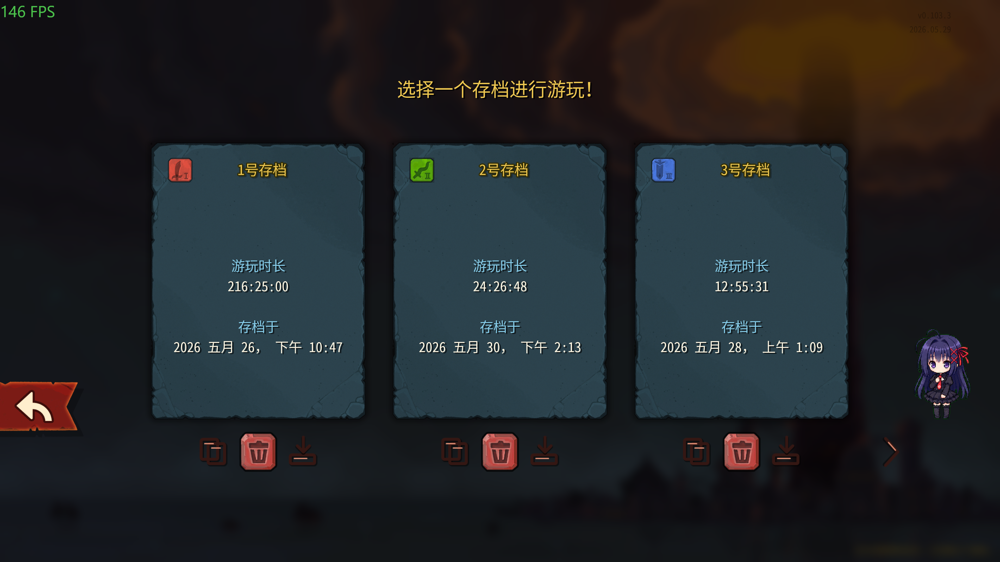

<p align="center">
  <a href="README.md"></a>
  <a href="README_en.md"></a>
  <a href="CHANGELOG.md"></a>
  <a href="https://github.com/JMC-Mods/SlayTheSpire2_BetterSaveSlots/releases"></a>
<!-- code-stats:start -->
  <a href="https://github.com/JMC-Mods/SlayTheSpire2_BetterSaveSlots/actions/workflows/code-lines.yml"></a>
  <a href="https://github.com/JMC-Mods/SlayTheSpire2_BetterSaveSlots/actions/workflows/code-lines.yml"></a>
  <a href="https://github.com/JMC-Mods/SlayTheSpire2_BetterSaveSlots/actions/workflows/code-lines.yml"></a>
  <a href="https://github.com/JMC-Mods/SlayTheSpire2_BetterSaveSlots/actions/workflows/code-lines.yml"></a>
  <a href="https://github.com/JMC-Mods/SlayTheSpire2_BetterSaveSlots/actions/workflows/code-lines.yml"></a>
  <a href="https://github.com/JMC-Mods/SlayTheSpire2_BetterSaveSlots/actions/workflows/code-lines.yml"></a>
  <a href="https://github.com/JMC-Mods/SlayTheSpire2_BetterSaveSlots/actions/workflows/code-lines.yml"></a>
<!-- code-stats:end -->
</p>

# BetterSaveSlots
##  0. 安装

### Mod本体安装
Steam版本直接在创意工坊订阅即可（暂未开放）

其他版本可以自行编译，或者在[📦 Releases](https://github.com/JMC-Mods/SlayTheSpire2_BetterSaveSlots/releases)界面下载.zip后解压到游戏安装目录下的Mods
目录下（没有就新建一个）

### 前置安装
**此外，本模组强依赖于模组[JmcModLib](https://github.com/JMC-Mods/SlayTheSpire2_JmcModLib/releases)**，安装方法同上

安装完成后的目录结构如下：

```sh
-- Slay the Spire 2
    |-- SlayTheSpire2.exe
        |-- mods
             |-- JmcModLib
             |-- BetterSaveSlots
                  |-- BetterSaveSlots.dll
                  |-- BetterSaveSlots.pck
                  |-- BetterSaveSlots.json
```

### 存档迁移
> 当你第一次安装 MOD，游戏会默认将开启 MOD 的存档与没开启的隔离。本模组提供了更稳妥的一键导入：

启用 MOD 并进入游戏后，在存档界面点击导入按钮。MOD 目标槽已有存档时会确认覆盖。


---
## 🧠 1. 简介
BetterSaveSlots 用于增强《杀戮尖塔 2》的存档槽管理：在原有三槽基础上支持复制粘贴、普通模式存档导入 MOD 存档、以及可配置新增存档槽位。

[演示视频（B站）](https://www.bilibili.com/video/BV1RRVG6cEez/)

[Github仓库](https://github.com/JMC-Mods/SlayTheSpire2_BetterSaveSlots)
## ⚙️ 2. 功能
- 存档选择界面每个槽位增加复制/粘贴按钮，覆盖已有存档前会弹出确认框
    
- 在存档界面导入普通模式存档到 MOD 存档目录
    
- 使用 JmcModLib 设置滑条配置总存档槽数，当前上限为 12
    
- 超过 3 个槽位时，存档选择界面按每页 3 个槽位分页显示
    
## 🔔 3. 提醒
- **本模组强依赖于模组[JmcModLib](https://github.com/JMC-Mods/SlayTheSpire2_JmcModLib/releases)**
- 扩展槽位只面向 MOD 环境；普通原版仍建议只使用 1-3 号槽
- 存档覆盖属于危险操作，请确认目标槽不再需要后再覆盖
 
## 🧩 4. 兼容性
- 由于游戏处于EA阶段，可能会随着游戏版本更新而失效

## 🧭 5. TODO
- 继续观察游戏版本更新后存档与云同步接口的变化

**如果你喜欢这个 Mod 的话，希望可以点一个star~**
